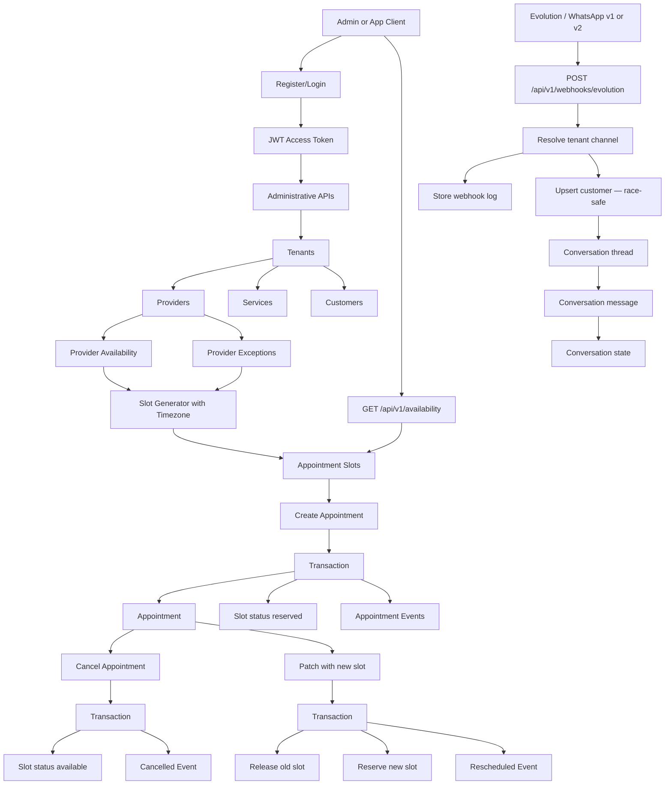

# Appointments MVP API

Multi-tenant appointment scheduling SaaS backend for barbershops, salons, beauty centers, and similar small businesses. The MVP exposes administrative APIs, provider availability, slot generation, bookings, conversation storage, and an Evolution/WhatsApp webhook foundation.

## Stack

- Go 1.23+
- Fiber
- PostgreSQL
- SQLC-style query layer
- Viper configuration
- JWT authentication
- Docker and Docker Compose
- golang-migrate

## Server

Configuration is loaded from `app.env`.

Required variables:

```env
APP_PORT=8040
APP_NAME=appointments
APP_DEBUG=true
DB_CONNECTION=postgres
DB_HOST=<host>
DB_PORT=<port>
DB_DATABASE=<database>
DB_USERNAME=<user>
DB_PASSWORD=<password>
TOKEN_SECRET_KEY=<32-byte-secret>
ACCESS_TOKEN_DURATION=15m
REFRESH_TOKEN_DURATION=24h
MIGRATION_URL=file://internal/db/migration
ALLOWED_ORIGINS=http://localhost:3000
```

Run locally:

```bash
go run main.go
```

Run tests:

```bash
go test ./...
```

If the default Go cache is not writable in your environment:

```bash
GOCACHE=/tmp/go-build-cache go test ./...
```

Docker:

```bash
docker-compose up --build
```

## Project Structure

```text
internal/
  api/
    dto/             Request/response DTOs
    handlers/        Fiber HTTP handlers
    middleware/      JWT auth + role middleware
    response/        Shared HTTP error mapping
    validators/      Request validation wrapper
    server.go        Fiber server setup (rate limiter)
  db/
    migration/       Database migrations
    query/           SQLC query definitions
    sqlc/            SQLC generated/manual query wrappers
  platform/
    pagination/      Pagination helpers
  repositories/      Persistence interfaces/adapters
  routes/            Route registration (inline RequireRole)
  services/          Business logic and transactions
  token/             JWT maker and payload
  util/              Config, password, random helpers
```

## Authentication

Public auth endpoints (rate-limited: 10 req/min per IP):

```text
POST /register
POST /login
POST /tokens/renew_access
```

Protected endpoints require:

```http
Authorization: Bearer <access_token>
```

Example:

```bash
curl -X POST http://localhost:8040/register \
  -H "Content-Type: application/json" \
  -d '{"username":"dev_local","password":"devpass123","full_name":"Dev Local"}'

curl -X POST http://localhost:8040/login \
  -H "Content-Type: application/json" \
  -d '{"username":"dev_local","password":"devpass123"}'
```

## Role-Based Access Control (RBAC)

The API implements three role levels. Authorization is enforced **inline per route** using `middleware.RequireRole()`. The previous static `RoutePermissions` table has been removed.

Multi-tenant isolation is enforced by `middleware.RequireTenant()` on every list endpoint that accepts a `tenant_id` query parameter. A `tenantUser` can only access resources that belong to their own tenant (validated against the JWT payload).

### **Admin User (`adminUser`)**
- Full access to all API endpoints
- Can manage tenants, providers, services, customers
- Can create, update, and delete users
- Can link users to tenants and providers

### **Tenant User (`tenantUser`)**
- Can manage providers, services, customers within **their own tenant only**
- Can manage user-provider associations within their tenant
- Cross-tenant access to a resource returns `404` (not `403`) to prevent existence leakage
- On write operations, `tenant_id` in the request body is ignored — the JWT value is always used

### **Regular User (`user`)**
- Scoped to their own tenant, same as `tenantUser`
- Can manage customers and appointments
- Can view provider availability and exceptions
- Can generate and query appointment slots
- Cross-tenant access returns `404`

### User Management Routes (Admin Only)

```text
GET    /api/v1/users              List all users with pagination
POST   /api/v1/users              Create user with role
GET    /api/v1/users/:id          Get user details         (id = UUID)
PUT    /api/v1/users/:id          Update user role/tenant  (id = UUID)
DELETE /api/v1/users/:id          Delete user (CASCADE)    (id = UUID)
POST   /api/v1/users/:id/tenant   Link user to tenant      (id = UUID)
GET    /api/v1/users/:id/providers List user's providers   (id = UUID)
POST   /api/v1/users/:id/provider Link user to provider    (id = UUID)
DELETE /api/v1/users/:id/provider  Unlink user from provider (id = UUID)
```

> **Note:** User IDs are now UUID (consistent with all other domain entities).
> The `UserResponse.id` field is `uuid.UUID` — update any clients that previously expected an integer.

### Role Assignment Example

Create admin user:
```bash
curl -X POST http://localhost:8040/api/v1/users \
  -H "Authorization: Bearer $TOKEN" \
  -H "Content-Type: application/json" \
  -d '{
    "username":"admin_user",
    "password":"adminpass123",
    "full_name":"Admin User",
    "role":"adminUser"
  }'
```

Create tenant user (linked to tenant):
```bash
curl -X POST http://localhost:8040/api/v1/users \
  -H "Authorization: Bearer $TOKEN" \
  -H "Content-Type: application/json" \
  -d '{
    "username":"tenant_owner",
    "password":"tenantpass123",
    "full_name":"Tenant Owner",
    "role":"tenantUser",
    "tenant_id":"<TENANT_UUID>"
  }'
```

Link user to provider (admin or tenant user):
```bash
curl -X POST http://localhost:8040/api/v1/users/<USER_UUID>/provider \
  -H "Authorization: Bearer $TOKEN" \
  -H "Content-Type: application/json" \
  -d '{"provider_id":"<PROVIDER_UUID>"}'
```

## API Routes

Administrative routes (Admin only):

```text
GET    /api/v1/tenants
POST   /api/v1/tenants
GET    /api/v1/tenants/:id
PUT    /api/v1/tenants/:id
DELETE /api/v1/tenants/:id
```

User management (Admin only):

```text
GET    /api/v1/users
POST   /api/v1/users
GET    /api/v1/users/:id
PUT    /api/v1/users/:id
DELETE /api/v1/users/:id
POST   /api/v1/users/:id/tenant
GET    /api/v1/users/:id/providers
POST   /api/v1/users/:id/provider    (Admin + Tenant User)
DELETE /api/v1/users/:id/provider    (Admin + Tenant User)
```

Provider / Service / Channel routes (Admin + Tenant User, tenant-isolated):

```text
GET    /api/v1/providers
POST   /api/v1/providers
GET    /api/v1/providers/:id
PUT    /api/v1/providers/:id
DELETE /api/v1/providers/:id

GET    /api/v1/services
POST   /api/v1/services
GET    /api/v1/services/:id
PUT    /api/v1/services/:id
DELETE /api/v1/services/:id

GET    /api/v1/tenant-channels
POST   /api/v1/tenant-channels
GET    /api/v1/tenant-channels/:id
PUT    /api/v1/tenant-channels/:id
DELETE /api/v1/tenant-channels/:id
```

Scheduling routes (All authenticated users):

```text
POST /api/v1/providers/:id/availability
GET  /api/v1/providers/:id/availability
POST /api/v1/providers/:id/exceptions
GET  /api/v1/providers/:id/exceptions
POST /api/v1/slot-generator
GET  /api/v1/availability
```

Appointment routes (All authenticated users):

```text
POST   /api/v1/appointments
GET    /api/v1/appointments
GET    /api/v1/appointments/:id
PATCH  /api/v1/appointments/:id
DELETE /api/v1/appointments/:id
```

Customer routes (All authenticated users):

```text
GET    /api/v1/customers
POST   /api/v1/customers
GET    /api/v1/customers/:id
PUT    /api/v1/customers/:id
```

Conversation and webhook routes:

```text
GET  /api/v1/conversations
GET  /api/v1/conversations/:id
POST /api/v1/conversations/message
POST /api/v1/inbound-messages

POST /api/v1/webhooks/evolution   (public — no JWT required)
```

Health routes (no auth, no rate limit):

```text
GET /healthz   liveness probe — always 200 if the process is up
GET /readyz    readiness probe — 200 if DB reachable, 503 otherwise
```

`POST /api/v1/webhooks/evolution` is public so Evolution can call it without a JWT. It resolves tenants through `tenant_channels.external_id`. The handler supports both Evolution API v1 (flat JSON) and **v2 nested payload** (`data.key.remoteJid`, `data.message.conversation`).

## Pagination and Filters

All list endpoints use `page` / `page_size` parameters (consistent — `limit`/`offset` removed from `/users`):

```text
page        (default: 1)
page_size   (default: 20, max: 100)
search
active
tenant_id
provider_id
customer_id
status
date
```

Common examples:

```bash
curl -H "Authorization: Bearer $TOKEN" \
  "http://localhost:8040/api/v1/providers?tenant_id=$TENANT_ID&page=1&page_size=20"

curl -H "Authorization: Bearer $TOKEN" \
  "http://localhost:8040/api/v1/availability?tenant_id=$TENANT_ID&provider_id=$PROVIDER_ID&date=2026-06-01"
```

## Slot Generation

The slot generator uses the tenant's IANA timezone so that slots are stored with correct local timestamps. Pass `timezone` in the request body:

```bash
curl -X POST http://localhost:8040/api/v1/slot-generator \
  -H "Authorization: Bearer $TOKEN" \
  -H "Content-Type: application/json" \
  -d '{
    "tenant_id": "<TENANT_UUID>",
    "provider_id": "<PROVIDER_UUID>",
    "number_of_weeks": 4,
    "slot_minutes": 30,
    "timezone": "America/Argentina/Buenos_Aires"
  }'
```

`number_of_weeks` is capped at **12** to prevent runaway generation. If `timezone` is omitted the server falls back to UTC.

## Booking Flow

1. Create tenant (include `timezone`, e.g. `"America/Argentina/Buenos_Aires"`).
2. Create providers, services, and customers for the tenant.
3. Add provider weekly availability.
4. Add provider exceptions for blocked periods.
5. Generate appointment slots (include `timezone`).
6. Query available slots.
7. Book an appointment using an available slot.
8. Appointment creation reserves the slot transactionally.
9. Cancellation marks the appointment cancelled and releases the slot.
10. Rescheduling releases the old slot, reserves the new slot, updates the appointment, and creates an appointment event.

## Application Flow



## Insomnia Collection

Import this file into Insomnia:

```text
docs/insomnia-appointments-mvp.json
```

After login, copy:

- `response.access_token` into `access_token`
- `response.refresh_token` into `refresh_token`

Then create resources in order and copy returned IDs into the environment variables. Note that `user_id` is now a **UUID string** (not an integer).

For the slot generator, include `"timezone": "America/Argentina/Buenos_Aires"` in the request body.

For webhook testing, `tenant_channel_external_id` must match an active row in `tenant_channels.external_id`. The webhook endpoint accepts both the legacy flat payload and the Evolution v2 nested format.

## Breaking Changes

### `fixes` branch

| Area | Change |
|---|---|
| `UserResponse.id` | Changed from `int32` to `uuid.UUID` |
| `/api/v1/users/:id` path param | Changed from integer to UUID |
| `POST /api/v1/slot-generator` | New optional field `timezone` (IANA string) |
| `GET /api/v1/users` | Pagination params changed from `limit`/`offset` to `page`/`page_size` |
| `POST /api/v1/webhooks/evolution` | Now parses Evolution v2 nested payload |

### `fix/fase0-security-hardening` branch

| Area | Change |
|---|---|
| JWT payload `user_id` | New field `user_id` (int32) carries the real user DB ID. Clients that previously used `decoded.id` as user ID must switch to `decoded.user_id`. `decoded.id` remains the session UUID. |
| Appointment `status` on creation | Changed from `reserved` to `confirmed`. Valid values enforced by DB constraint: `confirmed`, `cancelled`, `completed`, `no_show`. |
| Cross-tenant resource access | Now returns `404` instead of `403`. This applies to all `GET /:id`, `PUT /:id`, `DELETE /:id` routes for providers, services, customers, tenant channels, appointments, and conversations. |
| `user` role tenant enforcement | Previously the `user` role bypassed tenant scope on list endpoints. Now enforced identically to `tenantUser`. |
| Go module path | Renamed from `github.com/mousav1/ticket` to `github.com/unknowncode44/appointments`. |
| `ALLOWED_ORIGINS` config | New required env variable. CORS no longer allows `*`; only origins listed here are permitted. |
