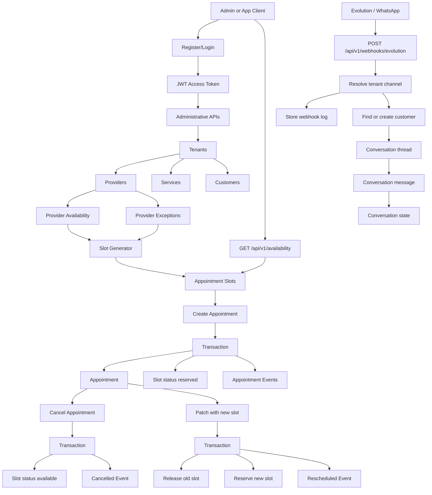

# Appointments MVP API

Multi-tenant appointment scheduling SaaS backend for barbershops, salons, beauty centers, and similar small businesses. The MVP exposes administrative APIs, provider availability, slot generation, bookings, conversation storage, and an Evolution/WhatsApp webhook foundation.

## Stack

- Go 1.23+
- Fiber
- PostgreSQL
- SQLC-style query layer
- Viper configuration
- JWT authentication
- Docker and Docker Compose
- golang-migrate

## Server

Configuration is loaded from `app.env`.

Required variables:

```env
APP_PORT=8040
APP_NAME=appointments
APP_DEBUG=true
DB_CONNECTION=postgres
DB_HOST=<host>
DB_PORT=<port>
DB_DATABASE=<database>
DB_USERNAME=<user>
DB_PASSWORD=<password>
TOKEN_SECRET_KEY=<32-byte-secret>
ACCESS_TOKEN_DURATION=15m
REFRESH_TOKEN_DURATION=24h
MIGRATION_URL=file://internal/db/migration
```

Run locally:

```bash
go run main.go
```

Run tests:

```bash
go test ./...
```

If the default Go cache is not writable in your environment:

```bash
GOCACHE=/tmp/go-build-cache go test ./...
```

Docker:

```bash
docker-compose up --build
```

## Project Structure

```text
internal/
  api/
    dto/             Request/response DTOs
    handlers/        Fiber HTTP handlers
    middleware/      JWT auth middleware
    response/        Shared HTTP error mapping
    validators/      Request validation wrapper
    server.go        Fiber server setup
  db/
    migration/       Database migrations
    query/           SQLC query definitions
    sqlc/            SQLC generated/manual query wrappers
  platform/
    pagination/      Pagination helpers
  repositories/      Persistence interfaces/adapters
  routes/            Route registration
  services/          Business logic and transactions
  token/             JWT maker and payload
  util/              Config, password, random helpers
```

## Authentication

Public auth endpoints:

```text
POST /register
POST /login
POST /tokens/renew_access
```

Protected endpoints require:

```http
Authorization: Bearer <access_token>
```

Example:

```bash
curl -X POST http://localhost:8040/register \
  -H "Content-Type: application/json" \
  -d '{"username":"dev_local","password":"devpass123","full_name":"Dev Local"}'

curl -X POST http://localhost:8040/login \
  -H "Content-Type: application/json" \
  -d '{"username":"dev_local","password":"devpass123"}'
```

## Role-Based Access Control (RBAC)

The API implements three role levels:

### **Admin User (`adminUser`)**
- Full access to all API endpoints
- Can manage tenants, providers, services, customers
- Can create, update, and delete users
- Can link users to tenants and providers

### **Tenant User (`tenantUser`)**
- Can manage providers, services within their tenant
- Can view customers
- Can manage user-provider associations
- Scoped to their assigned tenant

### **Regular User (`user`)**
- Can manage customers and appointments
- Can view provider availability and exceptions
- Can generate and query appointment slots
- Limited to appointment booking and scheduling

### User Management Routes (Admin Only)

```text
GET    /api/v1/users              List all users with pagination
POST   /api/v1/users              Create user with role
GET    /api/v1/users/:id          Get user details
PUT    /api/v1/users/:id          Update user role/tenant
DELETE /api/v1/users/:id          Delete user (CASCADE)
POST   /api/v1/users/:id/tenant   Link user to tenant
GET    /api/v1/users/:id/providers List user's providers
POST   /api/v1/users/:id/provider Link user to provider
DELETE /api/v1/users/:id/provider  Unlink user from provider
```

### Role Assignment Example

Create admin user:
```bash
curl -X POST http://localhost:8040/api/v1/users \
  -H "Authorization: Bearer $TOKEN" \
  -H "Content-Type: application/json" \
  -d '{
    "username":"admin_user",
    "password":"adminpass123",
    "full_name":"Admin User",
    "role":"adminUser"
  }'
```

Create tenant user (linked to tenant):
```bash
curl -X POST http://localhost:8040/api/v1/users \
  -H "Authorization: Bearer $TOKEN" \
  -H "Content-Type: application/json" \
  -d '{
    "username":"tenant_owner",
    "password":"tenantpass123",
    "full_name":"Tenant Owner",
    "role":"tenantUser",
    "tenant_id":"<TENANT_UUID>"
  }'
```

Link user to provider (admin or tenant user):
```bash
curl -X POST http://localhost:8040/api/v1/users/<USER_ID>/provider \
  -H "Authorization: Bearer $TOKEN" \
  -H "Content-Type: application/json" \
  -d '{"provider_id":"<PROVIDER_UUID>"}'
```

## API Routes

Administrative routes (Admin + Tenant User):

```text
GET    /api/v1/tenants
POST   /api/v1/tenants
GET    /api/v1/tenants/:id
PUT    /api/v1/tenants/:id
DELETE /api/v1/tenants/:id

GET    /api/v1/users              (Admin only)
POST   /api/v1/users              (Admin only)
GET    /api/v1/users/:id          (Admin only)
PUT    /api/v1/users/:id          (Admin only)
DELETE /api/v1/users/:id          (Admin only)
POST   /api/v1/users/:id/tenant   (Admin only)
GET    /api/v1/users/:id/providers (Admin only)
POST   /api/v1/users/:id/provider (Admin + Tenant User)
DELETE /api/v1/users/:id/provider (Admin + Tenant User)

GET    /api/v1/providers
POST   /api/v1/providers
GET    /api/v1/providers/:id
PUT    /api/v1/providers/:id
DELETE /api/v1/providers/:id

GET    /api/v1/services
POST   /api/v1/services
GET    /api/v1/services/:id
PUT    /api/v1/services/:id
DELETE /api/v1/services/:id
```

Scheduling routes (All authenticated users):

```text
POST /api/v1/providers/:id/availability
GET  /api/v1/providers/:id/availability
POST /api/v1/providers/:id/exceptions
GET  /api/v1/providers/:id/exceptions
POST /api/v1/slot-generator
GET  /api/v1/availability
```

Appointment routes (All authenticated users):

```text
POST   /api/v1/appointments
GET    /api/v1/appointments
GET    /api/v1/appointments/:id
PATCH  /api/v1/appointments/:id
DELETE /api/v1/appointments/:id
```

Customer routes (All authenticated users):

```text
GET    /api/v1/customers
POST   /api/v1/customers
GET    /api/v1/customers/:id
PUT    /api/v1/customers/:id
```

Conversation and webhook routes:

```text
GET  /api/v1/conversations
GET  /api/v1/conversations/:id
POST /api/v1/conversations/message

POST /api/v1/webhooks/evolution
```

`POST /api/v1/webhooks/evolution` is public so Evolution can call it without a JWT. It resolves tenants through `tenant_channels.external_id`.

## Pagination and Filters

List endpoints support:

```text
page
page_size
search
active
tenant_id
provider_id
customer_id
status
date
```

Common examples:

```bash
curl -H "Authorization: Bearer $TOKEN" \
  "http://localhost:8040/api/v1/providers?tenant_id=$TENANT_ID&page=1&page_size=20"

curl -H "Authorization: Bearer $TOKEN" \
  "http://localhost:8040/api/v1/availability?tenant_id=$TENANT_ID&provider_id=$PROVIDER_ID&date=2026-06-01"
```

## Booking Flow

1. Create tenant.
2. Create providers, services, and customers for the tenant.
3. Add provider weekly availability.
4. Add provider exceptions for blocked periods.
5. Generate appointment slots.
6. Query available slots.
7. Book an appointment using an available slot.
8. Appointment creation reserves the slot transactionally.
9. Cancellation marks the appointment cancelled and releases the slot.
10. Rescheduling releases the old slot, reserves the new slot, updates the appointment, and creates an appointment event.

## Application Flow



## Manual Smoke Test

The API was exercised on `http://localhost:8040` with a generated user:

```text
dev_1780267353
```

Verified:

```text
POST /register                         201
POST /login                            200
POST /tokens/renew_access              201
GET  /user/info                        200
PUT  /user/update                      200
POST /user/password_change             200

Tenant CRUD/list                       200/201
Provider CRUD/list                     200/201
Service CRUD/list                      200/201
Customer CRUD/list                     200/201
Provider availability create/list      201/200
Provider exception create/list         201/200
Slot generator                         201
Availability query                     200
Appointment create/list/get/patch/delete 200/201
Conversation message/list/get          200/201
Evolution webhook                      202
```

## Insomnia Collection

Import this file into Insomnia:

```text
docs/insomnia-appointments-mvp.json
```

After login, copy:

- `response.access_token` into `access_token`
- `response.refresh_token` into `refresh_token`

Then create resources in order and copy returned IDs into:

- `tenant_id`
- `provider_id`
- `service_id`
- `customer_id`
- `slot_id`
- `appointment_id`
- `conversation_id`
- `tenant_channel_external_id`

For webhook testing, `tenant_channel_external_id` must match an active row in `tenant_channels.external_id`.
